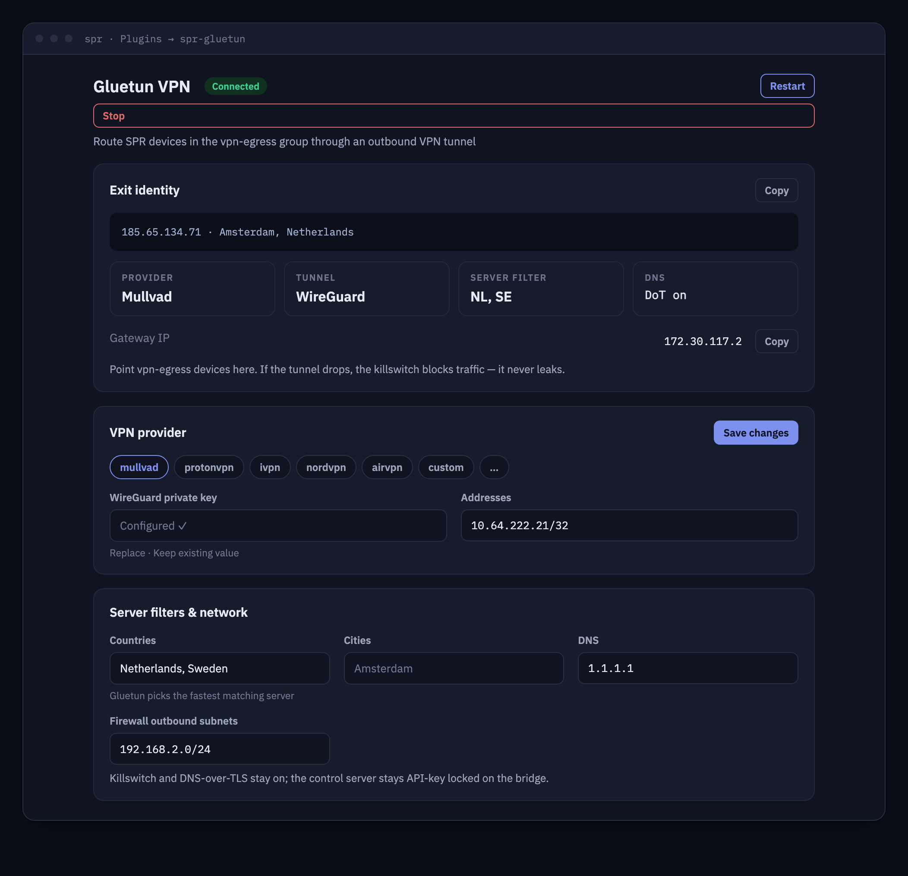

# spr-gluetun



An outbound VPN egress gateway plugin for [SPR](https://github.com/spr-networks/super),
built around [gluetun](https://github.com/qdm12/gluetun) — the swiss-army VPN client
container with a built-in killswitch firewall and DNS-over-TLS.

Configure a commercial VPN provider (Mullvad, Proton VPN, NordVPN, ...) or your own
WireGuard/OpenVPN server, then route selected SPR devices — the `vpn-glutun` group —
through the tunnel. Devices outside the group keep using your normal WAN.

This plugin was proposed on the SPR plugin wishlist
([spr-networks/super#341](https://github.com/spr-networks/super/issues/341)).

## How it integrates with SPR

The KVM runtime puts gluetun and the plugin API/UI in one isolated Linux guest.
The guest joins the dedicated `spr-gluetun` bridge as an SPR-managed device and
gets its address, gateway and DNS from SPR DHCP. Gluetun's control server listens
only on guest loopback. The plugin API is bridged to the host Unix socket over
virtio-vsock; no TCP or UDP control port is exposed.

The backend turns validated JSON config into gluetun's environment file
(`configs/plugins/spr-gluetun/gluetun.env`) and manages gluetun's control-server
API key.

## Features

- Provider config form: curated gluetun provider list, WireGuard (private/preshared
  key, addresses) or OpenVPN (user/password) credentials, server country/city
  filters, optional custom DNS
- `custom` provider support for your own WireGuard endpoint
- Status card: tunnel state, public IP, country/city — live from gluetun's control
  server
- Tunnel start / stop / restart from the UI (no docker access needed: uses gluetun's
  control server `PUT /v1/vpn/status`)
- Contributes to SPR's network topology view (`GET /topology`): the gluetun gateway
  container and, while the tunnel is up, the VPN exit ("City, Country" + public IP)
- Hardened gluetun defaults, always enforced: `FIREWALL=on` (killswitch), `DOT=on`
  by default, HTTP proxy and Shadowsocks off, control server never published
- Secrets are write-only through the API and stored 0600

## Install (UI)

1. In the SPR UI go to **Plugins**, click **+ New Plugin**
2. Enter this repository's URL, e.g. `https://github.com/spr-networks/spr-gluetun`
3. Enable the plugin, open its UI, configure a provider and save
4. Put the devices you want tunneled into the `vpn-glutun` group (Devices page)

## Install (CLI)

```bash
./install.sh
```

Prompts for your SPR directory (default `/home/spr/super/`) and an SPR API token.
On current SPR builds, installing through the Plugins UI is preferred because
Superd selects `docker-compose-kvm.yml` from the manifest's `Runtime: kvm` entry
and prepares DHCP authorization before starting the guest.

### Routing devices through the tunnel

Devices in the `vpn-glutun` group share connectivity with the Gluetun guest. SPR
learns the guest's DHCP address from its declared MAC and uses the topology sink
advertised by the plugin; no fixed container address or Docker service hostname
is used.

Set **Firewall outbound subnets** in the plugin UI to your SPR LAN subnet (e.g.
`192.168.2.0/24`) so gluetun's killswitch allows replies back to LAN devices.
If the tunnel is down, gluetun's firewall drops the traffic (fail closed).

## API

All endpoints are served over the plugin unix socket and reachable via the SPR API
at `/plugins/spr-gluetun/...`.

| Method | Path         | Description                                                              |
| ------ | ------------ | ------------------------------------------------------------------------ |
| GET    | `/status`    | Tunnel status + public IP/country/city from gluetun's control server     |
| GET    | `/config`    | Current config, secrets redacted (`WireguardKeySet`, `OpenVPNPasswordSet`) |
| PUT    | `/config`    | Validate + save config, regenerate `gluetun.env` and auth config         |
| PUT    | `/vpn`       | `{"Status":"running"}` or `{"Status":"stopped"}` — start/stop the tunnel |
| POST   | `/restart`   | Bounce the tunnel (stop then start) inside the running container         |
| GET    | `/providers` | Static curated list of gluetun-supported providers                       |
| GET    | `/topology`  | Plugin subgraph (`{Nodes, Edges}`) for SPR's topology view               |

`GET /topology` (advertised via `"HasTopology": true` in `plugin.json`) lets SPR
merge the plugin into the router topology view. It returns a root anchor node
(`ConnType` = the configured VPN type), a `gateway` node for the Gluetun guest
(using its current DHCP address, `Online` = control server reachable) and — only while the tunnel
is running — a `vpn-exit` node named "City, Country" with the tunnel's public IP,
connected `root → gateway → exit` on the `vpn` layer. Only honest live data is
emitted: with the tunnel down the graph is just root + gateway.

`POST /restart` and `PUT /vpn` act on the tunnel *inside* the running gluetun
container. Changes to provider/credentials (`gluetun.env`) are only read when the
container is recreated: toggle the plugin in SPR or run `docker compose restart`
in the plugin directory.

## Configuration reference (`PUT /config`)

| Field                     | Type     | Notes                                             |
| ------------------------- | -------- | ------------------------------------------------- |
| `Provider`                | string   | one of `GET /providers` (`mullvad`, `custom`, ...) |
| `VPNType`                 | string   | `wireguard` or `openvpn`                          |
| `WireguardPrivateKey`     | string   | write-only; base64, 32 bytes                      |
| `WireguardPresharedKey`   | string   | write-only, optional                              |
| `WireguardAddresses`      | []string | CIDRs assigned by the provider                    |
| `WireguardPublicKey`      | string   | `custom` provider only                            |
| `WireguardEndpointIP`     | string   | `custom` provider only                            |
| `WireguardEndpointPort`   | int      | `custom` provider only                            |
| `OpenVPNUser`             | string   | openvpn only                                      |
| `OpenVPNPassword`         | string   | write-only; openvpn only                          |
| `ServerCountries`         | []string | optional server filter                            |
| `ServerCities`            | []string | optional server filter                            |
| `DNSAddress`              | string   | optional custom upstream DNS IP                   |
| `DisableDNSOverTLS`       | bool     | default false (DoT on)                            |
| `FirewallOutboundSubnets` | []string | LAN subnets allowed outside the killswitch        |

Empty secret fields on `PUT` keep the previously stored value. Every value is
allow-list validated server-side before being rendered into `gluetun.env`
(no newlines, quotes or dotenv/compose metacharacters can be injected).

## Security model

- **No published host ports.** The UI/API is only reachable through the SPR-proxied
  unix socket; gluetun's control server (`:8000`) is bound to guest loopback and
  is additionally protected by a gluetun v3.39+ role config using
  a random API key. The key is generated by the backend at first run, stored 0600,
  restricted to the three routes the plugin uses, and never returned by any API.
- **Capabilities:** the KVM guest gets `NET_ADMIN` + `/dev/net/tun` so gluetun can
  create the tunnel interface and enforce its killswitch. The host runs no
  privileged gluetun sidecar.
- **Secrets:** VPN credentials live in `configs/plugins/spr-gluetun/config.json`
  and `gluetun.env`, both written atomically with mode 0600. `GET /config` returns
  only redacted state; gluetun's `/v1/vpn/settings` route (which would echo
  credentials) is deliberately not granted to the API key.
- **Killswitch:** `FIREWALL=on` is unconditional; if the tunnel drops, gluetun
  drops the traffic instead of leaking it to the WAN.

## Upstream

- [gluetun](https://github.com/qdm12/gluetun) by @qdm12 — MIT licensed. This plugin
  runs the unmodified upstream image `qmcgaw/gluetun`, pinned by digest.
- Provider setup docs: [gluetun wiki](https://github.com/qdm12/gluetun-wiki).

## Reproducible builds

Every build input is pinned: base images by digest, the Go toolchain by version +
sha256, apt packages via `snapshot.ubuntu.com`, and the upstream gluetun image by
digest (`GLUETUN_REF` in `reproducible.env`).

- `./build_docker_compose.sh` — reproducible local build (buildx + pinned BuildKit,
  `rewrite-timestamp=true`, `SOURCE_DATE_EPOCH=0`)
- `./update-pins.sh` — re-resolve all pins (including the gluetun image digest) and
  sync them into `reproducible.env`, the `Dockerfile` and `docker-compose.yml`

## Development

```bash
cd code && go test ./...                 # backend unit tests
cd frontend && yarn install && yarn start   # UI dev server (iframe dev mode)
```
